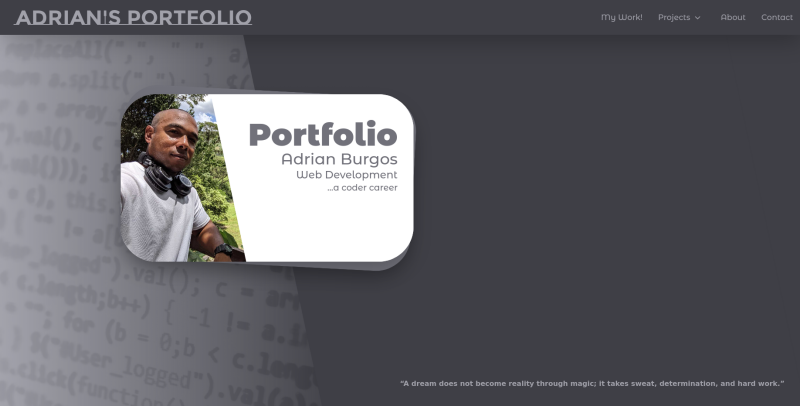

# My Portfolio

This is my portfolio web page.

## Table of contents

- [Overview](#overview)
  - [The challenge](#the-challenge)
  - [Screenshot](#screenshot)
  - [Links](#links)
- [My process](#my-process)
  - [Built with](#built-with)
  - [What I learned](#what-i-learned)
  - [Continued development](#continued-development)
  - [Useful resources](#useful-resources)
- [Author](#author)
- [Acknowledgments](#acknowledgments)

## Overview

### This Project

In this project I will use some of my skills, this is where I will show my work so far as a coder.

### Screenshot

### Links

- Source Code URL: [https://github.com/adrianburgoscolas/portfolio](https://github.com/adrianburgoscolas/portfolio)
- Live Site URL: [https://adrianburgoscolas.github.io/portfolio/](https://adrianburgoscolas.github.io/portfolio/)

## My process

### Built with

- Semantic HTML5 markup
- CSS custom properties
- Flexbox
- Grid
- Javascript
- Mobile-first workflow

### What I learned

In this project I was be able to level up my skill using a Mobile-first workflow and practicing Semantic HTML5 markup and styling whit TailwindCSS and JavaScript also improving coding accessible web pages and web components.

### Continued development

Need to keep improving Semantic HTML5 and accessibility.

### Useful resources

- [freeCodeCamp](https://www.freecodecamp.org/learn) - I taked my first lesson about frontend debelopment from here, I think is a good begining.

## Author

- Portfolio - [Adrian Burgos](https://adrianburgoscolas.github.io/portfolio/)
- freeCodeCamp - [Adrian Burgos](https://www.freecodecamp.org/fcce3ec214d-b0f9-4ddc-b526-34aea3d1e4a3)
- Frontend Mentor - [@adrianburgoscolas](https://www.frontendmentor.io/profile/adrianburgoscolas)
- Linkedin - [linkedin.com/in/adrian-burgos-1776a6144](https://www.linkedin.com/in/adrian-burgos-1776a6144/)
